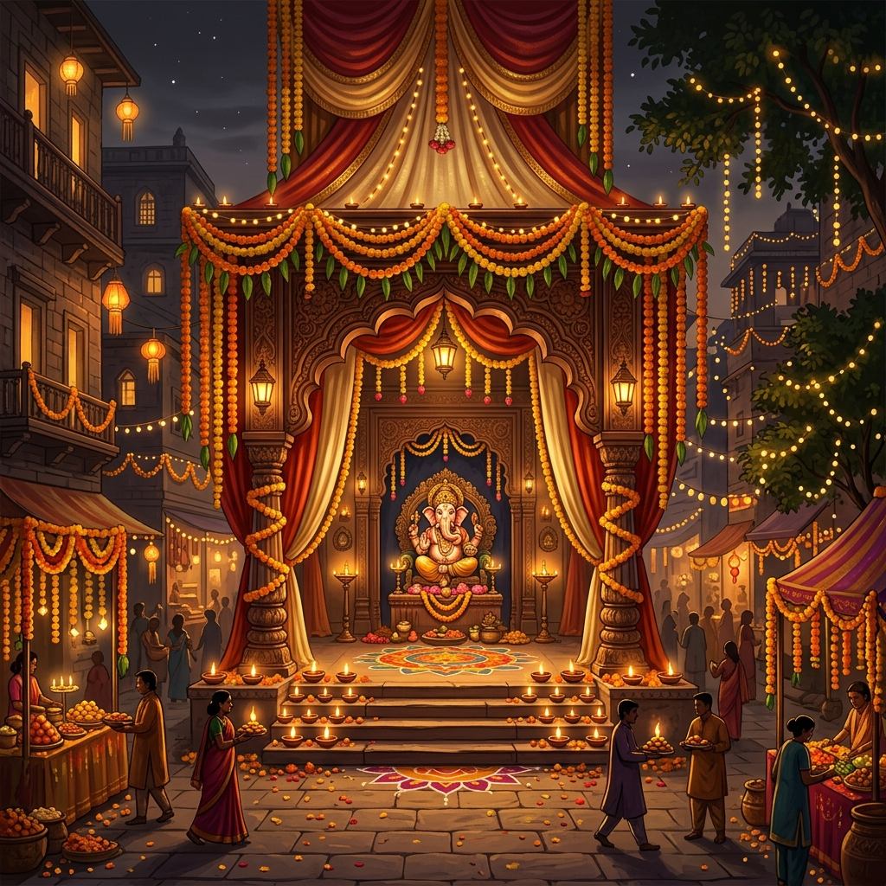

# 🐘 GANPATI UTSAV
> **"Build. Celebrate. Play."**



[](https://developer.mozilla.org/en-US/docs/Web/HTML)
[](https://developer.mozilla.org/en-US/docs/Web/CSS)
[](https://developer.mozilla.org/en-US/docs/Web/JavaScript)
[](https://developer.mozilla.org/en-US/docs/Web/API/Web_Audio_API)

A vibrant, 2D festival mini-game created for the **Ganesh Chaturthi Game Design Contest**. Built using pure Vanilla HTML5, CSS3, JavaScript, and HTML5 Canvas with a custom Web Audio API Sound Synthesizer.

---

## 🌟 Key Features

- **🌸 Stage 1: Pandal Decoration** - Decorate Lord Ganesha's Pandal with flowers, diyas, and festival ornaments before the timer runs out.
- **🎨 Stage 2: Rangoli Art** - Connect glowing dots on an interactive HTML5 Canvas to draw beautiful festive Rangoli patterns.
- **🪔 Stage 3: Puja Preparation** - Catch falling sacred thali items (flowers, coconuts, diyas, modaks) while avoiding distractor items.
- **🥁 Stage 4: Dhol Tasha Rhythm** - Tap instrument beat controls (`🥁 DHOL`, `🪘 TASHA`, `👏 CLAP`) as musical notes enter the golden target zone.
- **🌱 Stage 5: Eco Festival Challenge** - Make responsible, eco-friendly choices (natural clay idols, reusable decor, artificial immersion tanks) to preserve our rivers and lakes.
- **🐭 Stage 6 (Bonus): Mushak's Modak Sprint** - Move Mushak left and right to catch delicious falling Modaks in a fast-paced bonus round!
- **🏆 Results & Share System** - Score breakdown, rank evaluation (*FESTIVAL MASTER*, *UTSAV CHAMPION*, *FESTIVAL STAR*), confetti visual effects, and clipboard score card sharing.

---

## 🎵 Sound & Audio Engine

The game features an integrated **Procedural Web Audio API Synthesizer** (`js/audio.js`). 
- Dynamic sound synthesis for Dhol bass punches, Tasha rimshots, clap white-noise bursts, modak chimes, and victory chords.
- Ambient Indian Tanpura harmonic drone synthesizer for background music without external MP3 asset dependencies.

---

## 📁 Repository Structure

```
GANPATI UTSAV/
├── index.html            # Main HTML UI & stage containers
├── style.css             # Responsive styling & festive dark theme
├── README.md             # Project documentation
├── js/
│   ├── state.js          # State management & score calculations
│   ├── audio.js          # Web Audio API procedural sound synthesizer
│   └── main.js           # Game loops, mini-game controllers & UI events
├── assets/
│   ├── images/           # Generated festival backgrounds & game sprites
│   ├── audio/            # Audio asset directory
│   └── icons/            # Icon asset directory
└── main codes/           # Organised complete source copy
```

---

## 🚀 How to Play

1. Clone or download this repository:
   ```bash
   git clone https://github.com/charithpilla/GANPATI-UTSAV.git
   ```
2. Open `index.html` directly in any standard web browser (Chrome, Edge, Firefox, Safari).
3. Alternatively, serve locally using Python:
   ```bash
   python -m http.server 8080
   ```
   and navigate to `http://localhost:8080`.

---

## 🌐 Live GitHub Pages Deployment

To host live on GitHub Pages:
1. Go to your repository settings on GitHub.
2. Select **Pages** from the left navigation menu.
3. Set the source branch to `main` and root directory `/`.
4. Click **Save** to publish your live playable game URL!

---

## 📜 License
Created for the Ganesh Chaturthi Student Game Design Contest. Free to play and share! 🎉
